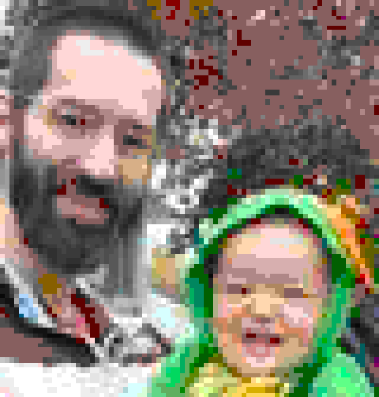

# Barf

Displays images in your terminal.  There are many existing utilities to 
accomplish this, but they're all way too complex.

## Installation

    $ gem install barf

## Usage

    $ barf Profile.jpg




## Details
* Can display anything supported by imagemagick including web resources.
* Applies the 256 color extended Ansi color palette with dithering.
* Multithreading is used to speed up the `tco` color operations.

```bash
$ barf https://avatars2.githubusercontent.com/u/382216
```


## Contributing

Bug reports and pull requests are welcome on GitHub at https://github.com/duffyjp/barf.

## License

The gem is available as open source under the terms of the [MIT License](https://opensource.org/licenses/MIT).
