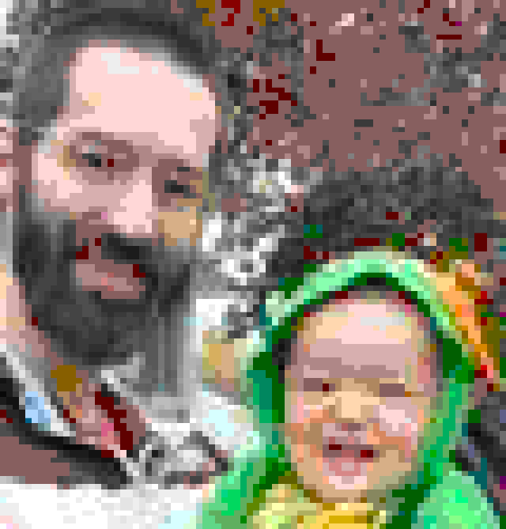

# Barf

Displays images in your terminal.



## Details

* Can display anything supported by ImageMagick, including web resources.
* Supports 24-bit true color on capable terminals, with automatic fallback to 256 colors.
* Applies dithering for a more natural look.
* Multithreading is used to speed things up.

## Installation

```bash
gem install barf
```

## Usage

```bash
# Display a local image
barf Profile.jpg

# Display an image from a URL
barf https://avatars2.githubusercontent.com/u/382216
```

## Development

### Prerequisites

* [Docker](https://www.docker.com/) (recommended) — no local Ruby or ImageMagick install needed
* **Or** Ruby 3.0+ and ImageMagick installed locally

### With Docker (recommended)

```bash
# Build the image
docker compose build

# Run tests
docker compose run --rm barf bundle exec rake spec

# Try the CLI on an image
docker compose run --rm barf exe/barf some_image.png

# Get an interactive shell
docker compose run --rm barf

# Rebuild after Gemfile or gemspec changes
docker compose build
```

The bundle cache is stored in a Docker volume, so subsequent runs skip gem installation.

### Without Docker

```bash
bin/setup            # install dependencies
bundle exec rake     # run tests
```

## Contributing

Bug reports and pull requests are welcome on GitHub at https://github.com/duffyjp/barf.

## License

The gem is available as open source under the terms of the [MIT License](https://opensource.org/licenses/MIT).
